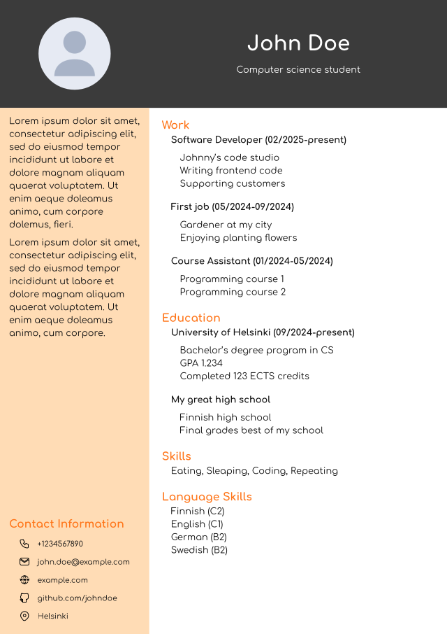

# My CV typst template

Example CV:

## Usage
- Install the [Typst compiler](https://typst.app/open-source/)
- Clone this repository and cd into it
- Modify the main.typ file with your own information
- Replace photo.jpg file with your own (make sure that the photo is a square)
- Compile with `typst compile main.typ`
- Your CV is in the file main.pdf

